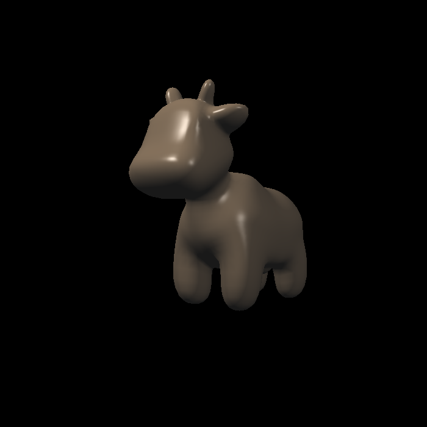
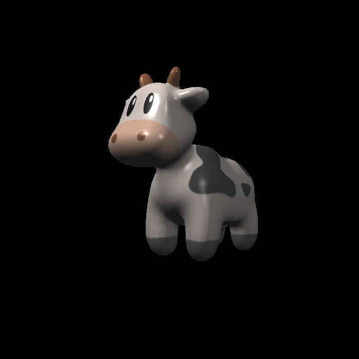

# Rasterizer

A soft rasterization renderer, implementation of basic graphics pipeline.

## Build

It runs on Windows and build with Visual Studio 2019

1. Add [OBJ_Loader](https://github.com/Bly7/OBJ-Loader) to the project
2. Add [stb/](https://github.com/nothings/stb) stb_image.h and stb_image_write.h to the project
3. Build and run
   
## Rendering pipeline

- Vertex Processing
  - Model transform
  - View transform
  - Projection
- Rasterization
- Fragment Processing
  - Blinn-phong shading
  - Texture mapping

## Result

- Blinn-Phong shading

- Texture mapping

## Something to be done

- Clipping
- Blending
- Mipmap
- Anti-aliasing
- optimizing
- ...
